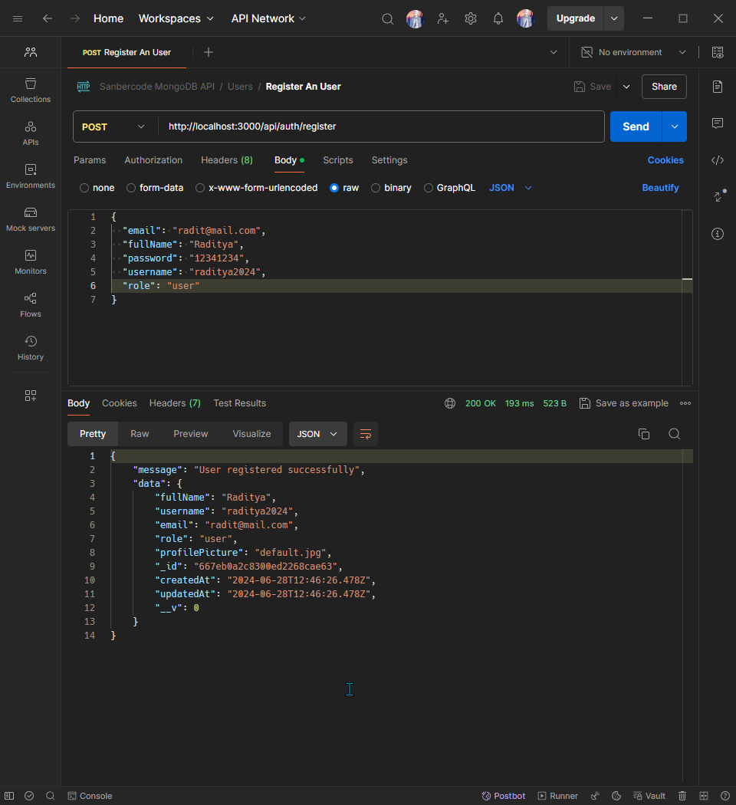
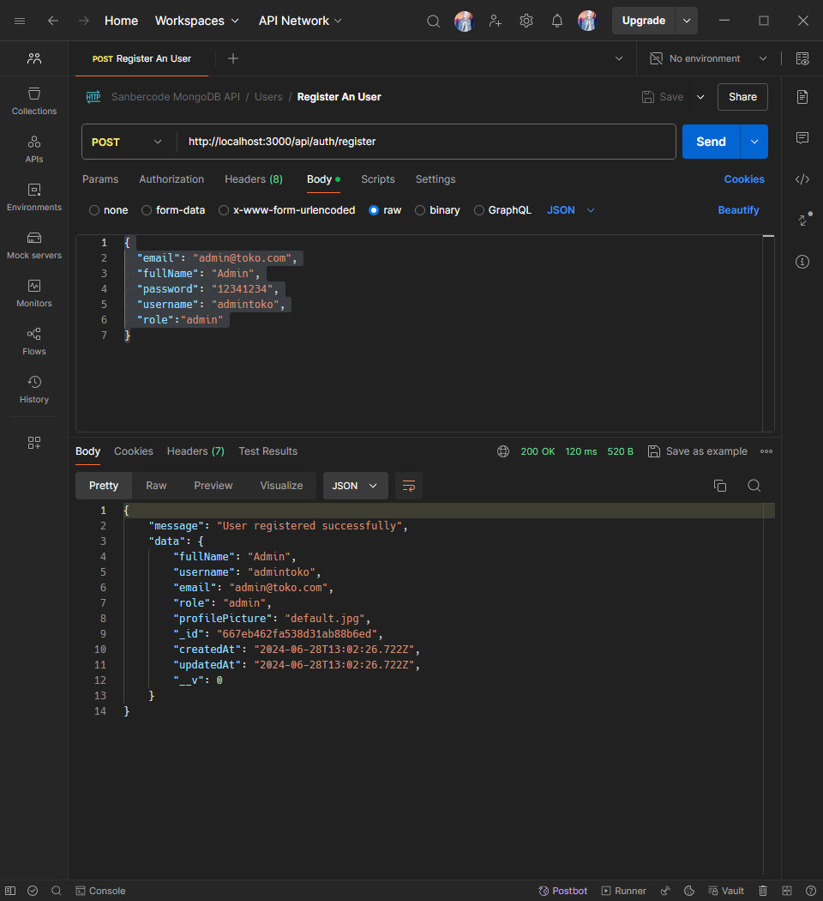
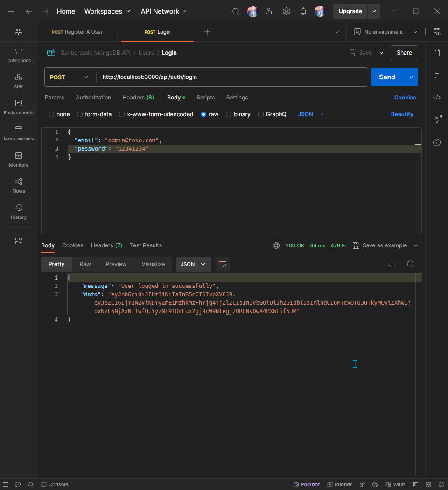
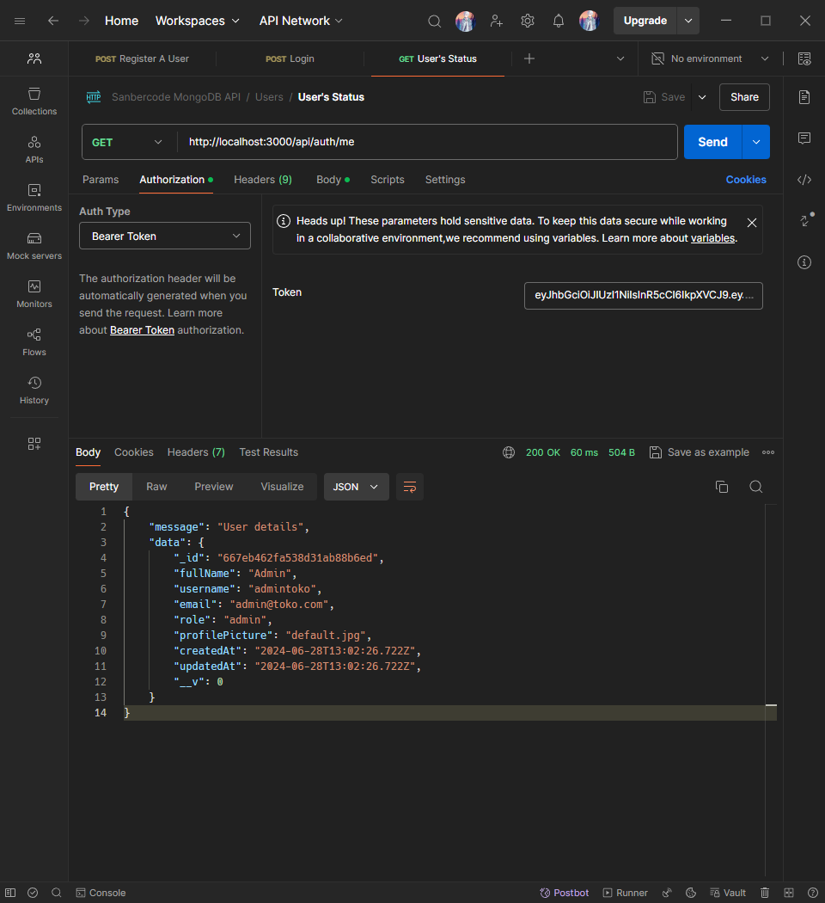

# Tugas 14 Sanbercode MongoDB API - Node.JS Backend

## Muhammad Ridwan Hakim

### Deploy Localhost

```bash
git clone https://github.com/rescenic/nodejs-tugas14.git

cd nodejs-tugas14

npm install

npm run dev
```

### Import Sanbercode MongoDB API.postman_collection.json to Postman

### Screenshots

#### 1. Register A User As User



#### 2. Register A User As Admin



#### 3. Login



#### 4. Check Status


