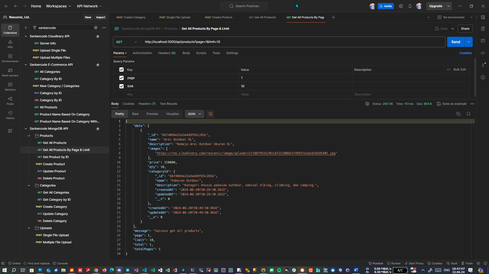
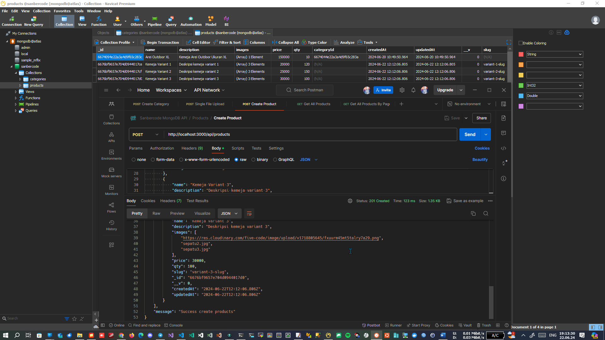

# Tugas 10 Sanbercode MongoDB API - Node.JS Backend

## Muhammad Ridwan Hakim

### Deploy Localhost

```bash
git clone https://github.com/rescenic/nodejs-tugas10.git

cd nodejs-tugas10

npm install

npm run dev
```

### Import Sanbercode MongoDB API.postman_collection.json to Postman

### Screenshots

#### 1. Create GET /api/products?page=1&limit=1



#### 2. Create POST /api/products


